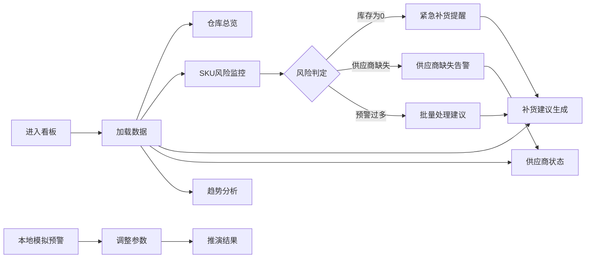

## 1. 产品概述

库存补货协同看板是一款面向供应链运营团队的实时监控与决策辅助工具，整合多维度库存数据，提供风险预警、智能补货建议和供应商协同管理功能。

- **核心目的**：帮助企业实时监控库存状态，提前识别缺货风险，优化补货决策，提升供应链协同效率
- **目标用户**：供应链经理、库存管理员、采购专员
- **核心价值**：降低缺货率，优化库存成本，提升供应商响应速度

## 2. 核心功能

### 2.1 用户角色

| 角色 | 登录方式 | 核心权限 |
|------|----------|----------|
| 运营管理员 | 账号密码登录 | 查看所有模块、模拟预警、导出数据 |
| 库存专员 | 账号密码登录 | 查看库存风险、补货建议 |
| 采购专员 | 账号密码登录 | 查看供应商协同、补货建议 |

### 2.2 功能模块

1. **仓库列表**：多仓库总览、库存健康度评分、快速筛选
2. **SKU 风险**：风险等级分类、库存异常详情、关联补货建议
3. **补货建议**：智能推荐补货量、优先级排序、批量操作
4. **供应商协同**：供应商状态监控、交付时效分析、异常提醒
5. **趋势概览**：库存趋势图表、风险趋势分析、补货效果追踪
6. **本地模拟预警**：模拟库存变化、预警规则配置、场景推演

### 2.3 页面详情

| 页面名称 | 模块名称 | 功能描述 |
|----------|----------|----------|
| 主看板 | 仓库列表 | 展示全部仓库，支持按名称/健康度筛选，点击查看详情 |
| 主看板 | SKU 风险 | 按风险等级（高/中/低）分类展示，库存为0标红，显示关联供应商 |
| 主看板 | 补货建议 | 展示推荐补货SKU列表，含建议补货量、优先级、预计成本 |
| 主看板 | 供应商协同 | 供应商状态卡片，交付及时率，响应异常高亮显示 |
| 主看板 | 趋势概览 | 折线图展示库存变化趋势，柱状图展示风险等级分布 |
| 主看板 | 本地模拟预警 | 滑杆模拟库存消耗，实时计算预警，支持自定义阈值 |

## 3. 核心流程

用户登录后进入主看板，系统自动加载最新数据。可通过仓库列表筛选关注仓库，SKU风险模块自动标记高风险商品并关联补货建议和供应商状态。发现风险后可直接查看补货建议，确认后发送至供应商协同模块。本地模拟预警支持推演不同库存消耗场景下的预警情况。

## 4. 用户界面设计

### 4.1 设计风格

- **主色调**：深海军蓝 (#0A1628) 作为背景，科技感青色 (#00D4AA) 作为强调色，警示红 (#FF4757)、预警橙 (#FFA502)、成功绿 (#2ED573) 构建风险语义
- **卡片样式**：圆角 12px，细微边框，悬浮时轻微上浮和阴影增强
- **字体**：JetBrains Mono 作为数据展示字体，Inter 作为界面字体，构建专业数据看板风格
- **布局**：模块化卡片布局，网格系统，信息密度适中
- **图标风格**：线性图标为主，关键状态使用填充图标强化视觉

### 4.2 页面设计概览

| 页面名称 | 模块名称 | UI 元素 |
|----------|----------|----------|
| 主看板 | 仓库列表 | 卡片网格布局，健康度环形进度条，状态徽章 |
| 主看板 | SKU 风险 | 表格布局，风险等级色标，库存0高亮闪烁，展开详情 |
| 主看板 | 补货建议 | 列表卡片，优先级标签，操作按钮组 |
| 主看板 | 供应商协同 | 横向滚动卡片，交付率环形图，状态指示灯 |
| 主看板 | 趋势概览 | 组合图表，渐变填充，时间轴切换 |
| 主看板 | 本地模拟预警 | 滑杆控制，实时计算动画，预警层级展示 |

### 4.3 响应式

- 桌面端优先设计，最小支持 1440px 宽度
- 平板端采用自适应网格，减少列数
- 移动端单列布局，折叠非核心模块

### 4.4 动效设计

- 页面加载：模块渐入动画，stagger 延迟 100ms
- 数据更新：数字滚动动画，高亮闪烁提示
- 卡片交互：hover 上浮 4px，阴影扩散
- 预警状态：呼吸灯动画效果
