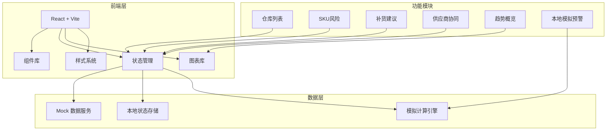
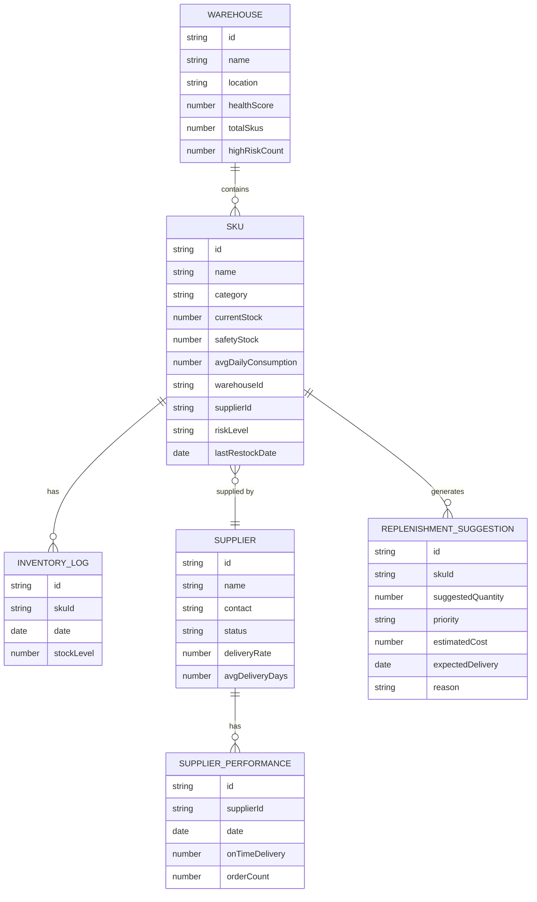

## 1. 架构设计



## 2. 技术描述

- **前端框架**：React@18 + TypeScript
- **构建工具**：Vite@5
- **样式方案**：TailwindCSS@3 + CSS Variables
- **图表库**：Recharts（轻量级 React 图表库）
- **图标库**：Lucide React
- **状态管理**：React Context + useReducer（轻量级全局状态）
- **数据方案**：本地 Mock 数据，无后端依赖
- **动画库**：Framer Motion（流畅动画效果）

## 3. 路由定义

| 路由 | 用途 |
|------|------|
| / | 主看板（所有模块整合展示） |

## 4. 数据模型

### 4.1 数据模型定义



### 4.2 TypeScript 类型定义

```typescript
// 仓库类型
interface Warehouse {
  id: string;
  name: string;
  location: string;
  healthScore: number;
  totalSkus: number;
  highRiskCount: number;
  mediumRiskCount: number;
  lowRiskCount: number;
}

// SKU 类型
interface Sku {
  id: string;
  name: string;
  category: string;
  currentStock: number;
  safetyStock: number;
  avgDailyConsumption: number;
  warehouseId: string;
  supplierId: string | null;
  riskLevel: 'high' | 'medium' | 'low';
  lastRestockDate: string;
  daysUntilOutOfStock: number;
}

// 供应商类型
interface Supplier {
  id: string;
  name: string;
  contact: string;
  status: 'active' | 'inactive' | 'warning';
  deliveryRate: number;
  avgDeliveryDays: number;
  pendingOrders: number;
  lastDeliveryDate: string;
}

// 补货建议类型
interface ReplenishmentSuggestion {
  id: string;
  skuId: string;
  skuName: string;
  suggestedQuantity: number;
  priority: 'urgent' | 'high' | 'normal';
  estimatedCost: number;
  expectedDelivery: string;
  reason: string;
  supplierId: string | null;
}

// 库存日志类型
interface InventoryLog {
  date: string;
  stockLevel: number;
}

// 预警配置类型
interface AlertConfig {
  highStockThreshold: number;
  mediumStockThreshold: number;
  supplierMissingAlert: boolean;
  maxAlertsBeforeBatch: number;
}
```

## 5. 模块结构

```
src/
├── components/
│   ├── WarehouseList/        # 仓库列表模块
│   ├── SkuRisk/              # SKU 风险模块
│   ├── Replenishment/        # 补货建议模块
│   ├── SupplierCollab/       # 供应商协同模块
│   ├── TrendOverview/        # 趋势概览模块
│   └── SimulationAlert/      # 本地模拟预警模块
├── data/
│   └── mockData.ts           # Mock 数据
├── hooks/
│   └── useInventoryLogic.ts  # 库存计算逻辑
├── types/
│   └── index.ts              # 类型定义
├── App.tsx
├── main.tsx
└── index.css
```

## 6. 核心业务逻辑

### 6.1 风险等级计算

```typescript
function calculateRiskLevel(sku: Sku): 'high' | 'medium' | 'low' {
  // 库存为 0 -> 高风险
  if (sku.currentStock === 0) return 'high';
  
  const daysUntilOutOfStock = sku.currentStock / sku.avgDailyConsumption;
  
  // 3 天内断货 -> 高风险
  if (daysUntilOutOfStock <= 3) return 'high';
  // 7 天内断货 -> 中风险
  if (daysUntilOutOfStock <= 7) return 'medium';
  // 其他 -> 低风险
  return 'low';
}
```

### 6.2 补货建议生成

```typescript
function generateSuggestion(sku: Sku, supplier: Supplier | null): ReplenishmentSuggestion {
  // 基础补货量 = 安全库存 * 2 - 当前库存
  const baseQuantity = Math.max(0, sku.safetyStock * 2 - sku.currentStock);
  
  // 根据供应商交付周期调整
  const deliveryBuffer = supplier 
    ? supplier.avgDeliveryDays * sku.avgDailyConsumption 
    : sku.safetyStock;
  
  return {
    suggestedQuantity: Math.ceil(baseQuantity + deliveryBuffer),
    priority: sku.currentStock === 0 ? 'urgent' : 
              sku.riskLevel === 'high' ? 'high' : 'normal',
    reason: sku.currentStock === 0 ? '库存已耗尽' :
            !supplier ? '供应商缺失，建议紧急采购' :
            `预计 ${sku.daysUntilOutOfStock} 天后断货`,
    // ...
  };
}
```

### 6.3 供应商缺失处理逻辑

- 高风险 SKU 无供应商 -> 标记为"供应商缺失"，优先级提升为 urgent
- 在补货建议中显示"需寻找新供应商"提示
- 触发批量处理建议（预警过多时）

### 6.4 预警过多处理逻辑

- 当高风险 SKU > 10 个时，触发批量处理建议
- 提供"一键生成全部补货单"功能
- 显示按供应商分组的汇总视图
