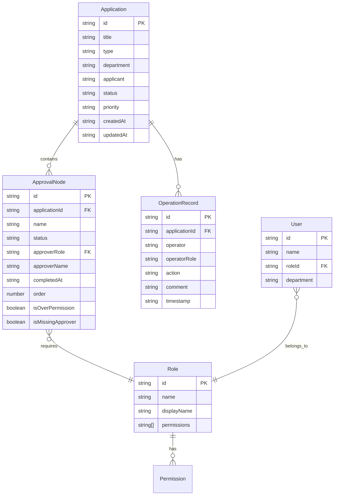

## 1. 架构设计

```mermaid
flowchart TD
    "前端展示层" --> "状态管理层 (Zustand)"
    "状态管理层 (Zustand)" --> "本地模拟数据层 (Mock Data)"
    "前端展示层" --> "组件层"
    "组件层" --> "申请列表组件"
    "组件层" --> "审批流节点组件"
    "组件层" --> "角色权限面板组件"
    "组件层" --> "操作记录时间线组件"
    "组件层" --> "统计图表组件"
    "组件层" --> "异常提醒组件"
```

## 2. 技术说明

- 前端：React@18 + TypeScript + Tailwind CSS@3 + Vite
- 初始化工具：vite-init (react-ts 模板)
- 状态管理：Zustand
- 图表库：recharts
- 后端：无（纯前端项目，使用本地模拟数据）
- 数据库：无（使用内存中的模拟数据集）

## 3. 路由定义

| 路由 | 用途 |
|------|------|
| / | 审批工作台主页面，包含所有功能模块 |

## 4. API定义

无后端API，所有数据通过本地模拟数据层提供。

## 5. 服务端架构图

不适用（纯前端项目）

## 6. 数据模型

### 6.1 数据模型定义



### 6.2 数据定义语言

使用 TypeScript 类型定义代替 DDL：

```typescript
type ApplicationStatus = "pending" | "in_progress" | "approved" | "rejected" | "withdrawn"
type ApplicationPriority = "low" | "medium" | "high" | "urgent"
type NodeType = "submit" | "review" | "approve" | "finance" | "ceo"
type NodeStatus = "pending" | "active" | "approved" | "rejected" | "skipped"
type ActionType = "submit" | "approve" | "reject" | "transfer" | "withdraw" | "comment"

interface Application {
  id: string
  title: string
  type: string
  department: string
  applicant: string
  status: ApplicationStatus
  priority: ApplicationPriority
  createdAt: string
  updatedAt: string
}

interface ApprovalNode {
  id: string
  applicationId: string
  name: string
  type: NodeType
  status: NodeStatus
  approverRole: string
  approverName: string | null
  completedAt: string | null
  order: number
  isOverPermission: boolean
  isMissingApprover: boolean
}

interface OperationRecord {
  id: string
  applicationId: string
  operator: string
  operatorRole: string
  action: ActionType
  comment: string
  timestamp: string
}

interface Role {
  id: string
  name: string
  displayName: string
  permissions: string[]
}

interface User {
  id: string
  name: string
  roleId: string
  department: string
}
```
