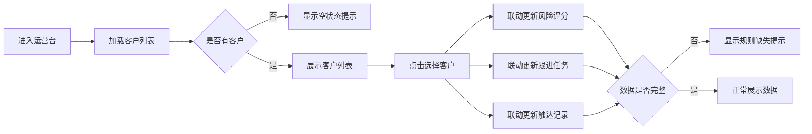

## 1. 产品概述
客户健康度运营台是面向客户成功团队的运营管理工具，帮助团队实时监控客户健康状态、管理跟进任务、记录客户触达历史，提升客户留存和满意度。

- 核心用户：客户成功经理、运营团队
- 核心价值：一站式客户健康管理，提升运营效率

## 2. 核心功能

### 2.1 用户角色
| 角色 | 注册方式 | 核心权限 |
|------|----------|----------|
| 运营人员 | 内部账号登录 | 查看客户列表、管理评分、创建任务、记录触达 |

### 2.2 功能模块
1. **客户健康度运营台（单页应用）**：客户列表、风险评分、跟进任务、触达记录

### 2.3 页面详情
| 页面名称 | 模块名称 | 功能描述 |
|----------|----------|----------|
| 运营台首页 | 客户列表 | 展示所有客户，支持点击选择，显示客户基本信息和健康状态标签 |
| 运营台首页 | 风险评分 | 显示选中客户的健康评分、风险等级、评分维度详情 |
| 运营台首页 | 跟进任务 | 显示选中客户的待办任务列表，支持任务状态展示 |
| 运营台首页 | 触达记录 | 显示选中客户的历史触达记录，按时间倒序排列 |

## 3. 核心流程
用户进入运营台 → 浏览客户列表 → 点击选择客户 → 右侧面板联动展示该客户的风险评分、跟进任务、触达记录 → 无客户选中或数据缺失时显示提示

## 4. 用户界面设计

### 4.1 设计风格
- 主色调：深海军蓝 `#0f172a`，搭配翡翠绿 `#10b981`（健康）、琥珀橙 `#f59e0b`（预警）、玫瑰红 `#f43f5e`（风险）
- 字体：标题使用 "Space Grotesk"，正文使用 "Inter"
- 布局：左侧客户列表（25%宽度），右侧三面板垂直布局（75%宽度）
- 卡片风格：圆角8px，微妙阴影，悬停微动效
- 图标：lucide-react 线性图标

### 4.2 页面设计概述
| 页面名称 | 模块名称 | UI 元素 |
|----------|----------|----------|
| 运营台首页 | 客户列表 | 搜索框、客户卡片（名称、行业、健康标签）、选中态高亮、滚动容器 |
| 运营台首页 | 风险评分 | 大号评分数字、风险等级徽章、维度评分条、空状态提示 |
| 运营台首页 | 跟进任务 | 任务卡片（标题、截止日期、优先级、状态标签）、空状态提示 |
| 运营台首页 | 触达记录 | 时间轴布局、触达方式标签、内容摘要、空状态提示 |

### 4.3 响应式
- 桌面端（>=1280px）：左侧列表 + 右侧三面板网格布局
- 平板端（768px-1279px）：顶部客户列表横向滚动，下方堆叠三个面板
- 移动端（<768px）：全垂直堆叠布局，客户列表可折叠

### 4.4 动效设计
- 客户切换时面板内容淡入淡出（300ms ease-out）
- 客户卡片悬停时轻微上浮 + 阴影加深
- 评分数字加载时滚动动画
- 空状态提示图标轻微呼吸动效
