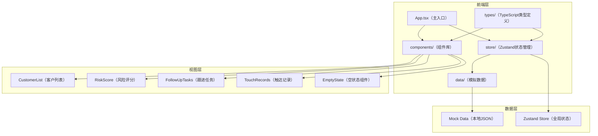
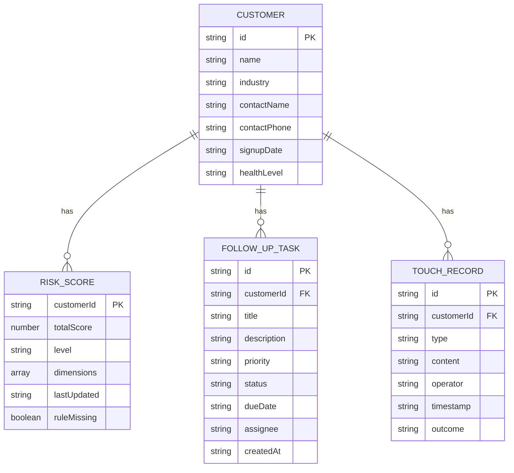

## 1. 架构设计


## 2. 技术描述
- 前端框架：React@18 + TypeScript@5 + Vite@5
- 样式方案：TailwindCSS@3.4
- 状态管理：Zustand@4
- 图标库：lucide-react@0.344
- 初始化工具：vite-init
- 数据方案：本地模拟数据（TypeScript常量）
- 无后端、无数据库

## 3. 路由定义
| 路由 | 用途 |
|------|------|
| / | 运营台首页（单页应用，无多路由） |

## 4. 数据模型

### 4.1 TypeScript 类型定义

```typescript
// 客户类型
interface Customer {
  id: string;
  name: string;
  industry: string;
  contactName: string;
  contactPhone: string;
  signupDate: string;
  healthLevel: 'healthy' | 'warning' | 'risk';
}

// 风险评分类型
interface RiskScore {
  customerId: string;
  totalScore: number;
  level: 'excellent' | 'good' | 'fair' | 'poor';
  dimensions: {
    name: string;
    score: number;
    weight: number;
  }[];
  lastUpdated: string;
  ruleMissing?: boolean;
}

// 跟进任务类型
interface FollowUpTask {
  id: string;
  customerId: string;
  title: string;
  description: string;
  priority: 'high' | 'medium' | 'low';
  status: 'pending' | 'in_progress' | 'completed';
  dueDate: string;
  assignee: string;
  createdAt: string;
}

// 触达记录类型
interface TouchRecord {
  id: string;
  customerId: string;
  type: 'call' | 'email' | 'meeting' | 'message';
  content: string;
  operator: string;
  timestamp: string;
  outcome: string;
}

// 全局状态
interface AppState {
  customers: Customer[];
  riskScores: Record<string, RiskScore>;
  tasks: Record<string, FollowUpTask[]>;
  records: Record<string, TouchRecord[]>;
  selectedCustomerId: string | null;
  selectCustomer: (id: string | null) => void;
  getSelectedCustomer: () => Customer | undefined;
  getCurrentRiskScore: () => RiskScore | undefined;
  getCurrentTasks: () => FollowUpTask[];
  getCurrentRecords: () => TouchRecord[];
}
```

### 4.2 数据模型关系图


## 5. 项目目录结构
```
src/
├── components/
│   ├── CustomerList.tsx      # 客户列表组件
│   ├── RiskScore.tsx         # 风险评分组件
│   ├── FollowUpTasks.tsx     # 跟进任务组件
│   ├── TouchRecords.tsx      # 触达记录组件
│   ├── EmptyState.tsx        # 空状态提示组件
│   └── ScoreGauge.tsx        # 评分仪表盘组件
├── store/
│   └── useAppStore.ts        # Zustand 全局状态
├── data/
│   └── mockData.ts           # 模拟数据
├── types/
│   └── index.ts              # TypeScript 类型定义
├── App.tsx                   # 主应用组件
├── main.tsx                  # 应用入口
└── index.css                 # 全局样式
```

## 6. 组件交互说明

1. **状态流**：
   - `CustomerList` 点击客户 → `useAppStore.selectCustomer(id)` 更新状态
   - `RiskScore` / `FollowUpTasks` / `TouchRecords` 通过 `useAppStore` 订阅 `selectedCustomerId` 变化
   - 状态变更触发组件重渲染，实现联动效果

2. **空状态处理**：
   - 客户列表为空 → 显示"暂无客户数据"提示
   - 未选中客户 → 显示"请选择一个客户"提示
   - 评分规则缺失 → 显示"评分规则配置缺失"警告提示
   - 任务/记录为空 → 显示对应空状态提示

3. **联动机制**：
   - 基于 Zustand 全局状态的订阅模式
   - 各面板组件独立订阅所需数据片段
   - 客户切换时自动获取对应数据并渲染
