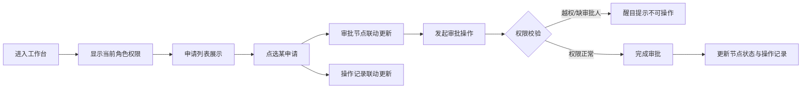

## 1. 产品概述

多角色审批工作台首版，为企业内不同角色用户提供统一的审批操作界面，解决跨角色审批流程不透明、权限边界不清晰的问题。

- 主要用途：集中展示审批申请、流程节点、操作权限和历史记录
- 目标用户：企业内各级审批人（员工、部门主管、财务、总经理等）
- 核心价值：流程可视化、权限清晰化、操作可追溯

## 2. 核心功能

### 2.1 用户角色

| 角色 | 注册方式 | 核心权限 |
|------|----------|----------|
| 普通员工 | 企业账号 | 提交申请、查看自己申请的审批进度 |
| 部门主管 | 企业账号 | 审批本部门员工的申请 |
| 财务专员 | 企业账号 | 审批涉及财务的申请节点 |
| 总经理 | 企业账号 | 审批大额/重要申请的最终节点 |

### 2.2 功能模块

1. **审批工作台主页**：申请列表区、审批节点区、角色权限提示区、操作记录区

### 2.3 页面详情

| 页面名称 | 模块名称 | 功能描述 |
|----------|----------|----------|
| 审批工作台 | 申请列表 | 展示所有审批申请（含状态、类型、申请人、金额），支持点选选中 |
| 审批工作台 | 审批节点 | 展示选中申请的审批流程节点，高亮当前节点，显示审批人及状态 |
| 审批工作台 | 角色权限提示 | 显示当前登录角色的可操作范围，越权或缺审批人时醒目提示 |
| 审批工作台 | 操作记录 | 展示选中申请的操作历史（时间、操作人、动作、备注），与申请联动更新 |

## 3. 核心流程

用户进入审批工作台 → 系统根据登录角色显示权限提示 → 用户从申请列表点选某条申请 → 审批节点区联动展示该申请的流程进度 → 操作记录区联动展示该申请的历史记录 → 用户尝试审批操作 → 系统校验权限（越权/缺审批人时给出提示） → 有权限则完成审批并更新记录

## 4. 用户界面设计

### 4.1 设计风格

- 主色调：商务深蓝 `#1e3a5f`，体现专业稳重
- 辅助色：审批通过绿 `#22c55e`、待审批橙 `#f59e0b`、已拒绝红 `#ef4444`、警示黄 `#eab308`
- 按钮风格：扁平圆角按钮，状态色填充，hover 微浮起
- 字体：标题使用 `Playfair Display` 衬线字体彰显专业感，正文使用 `Inter` 无衬线字体保证可读性
- 布局：四象限卡片式布局，左侧列表+右侧详情，顶部权限提示横幅
- 图标风格：线性极简图标，统一 16px/20px 尺寸

### 4.2 页面设计概述

| 页面名称 | 模块名称 | UI 元素 |
|----------|----------|----------|
| 审批工作台 | 整体布局 | 深色顶栏 + 浅灰背景 + 四卡片分区 + 微妙阴影层次 |
| 审批工作台 | 申请列表 | 行式列表，选中行高亮，状态色标签，hover 浅底色 |
| 审批工作台 | 审批节点 | 垂直时间轴，节点圆圈用状态色填充，连接线灰/绿渐变 |
| 审批工作台 | 角色权限提示 | 顶部横幅，权限正常时绿色，异常时红/橙色带警示图标 |
| 审批工作台 | 操作记录 | 时间倒序，每条记录含时间戳、操作人头像、动作标签 |

### 4.3 响应式

- 桌面端优先设计（1280px+），四卡片并排
- 平板端（768px-1279px）：上下两排，每排两卡片
- 移动端（<768px）：单列垂直堆叠，列表在上，详情在下
- 触控优化：按钮最小 44px 点击区域，列表行高 ≥ 52px

