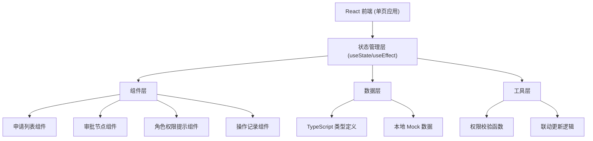
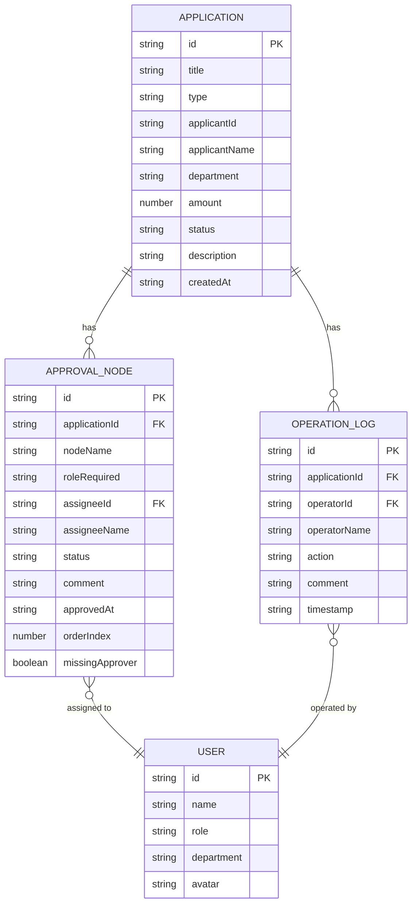

## 1. 架构设计



## 2. 技术描述

- 前端：React@18 + TypeScript + tailwindcss@3 + vite
- 初始化工具：vite-init
- 后端：无（纯前端模拟）
- 数据库：无，使用本地 JSON 模拟数据
- 状态管理：React Hooks（useState、useEffect）
- 图标：Lucide React

## 3. 路由定义

| 路由 | 用途 |
|------|------|
| / | 审批工作台主页（唯一页面） |

## 4. 数据模型

### 4.1 数据模型定义



### 4.2 TypeScript 类型定义

```typescript
type UserRole = 'employee' | 'manager' | 'finance' | 'director';

interface User {
  id: string;
  name: string;
  role: UserRole;
  department: string;
  avatar: string;
}

type ApplicationStatus = 'pending' | 'approved' | 'rejected' | 'processing';
type ApplicationType = 'leave' | 'expense' | 'purchase' | 'contract';

interface Application {
  id: string;
  title: string;
  type: ApplicationType;
  applicantId: string;
  applicantName: string;
  department: string;
  amount: number;
  status: ApplicationStatus;
  description: string;
  createdAt: string;
}

type NodeStatus = 'pending' | 'approved' | 'rejected' | 'current' | 'skipped';

interface ApprovalNode {
  id: string;
  applicationId: string;
  nodeName: string;
  roleRequired: UserRole;
  assigneeId: string | null;
  assigneeName: string | null;
  status: NodeStatus;
  comment: string | null;
  approvedAt: string | null;
  orderIndex: number;
  missingApprover: boolean;
}

type LogAction = 'submit' | 'approve' | 'reject' | 'delegate' | 'comment';

interface OperationLog {
  id: string;
  applicationId: string;
  operatorId: string;
  operatorName: string;
  action: LogAction;
  comment: string | null;
  timestamp: string;
}

interface PermissionCheckResult {
  canOperate: boolean;
  reason?: string;
  currentNodeId?: string;
}
```

## 5. 组件层级

```
App.tsx
├── RolePermissionBanner (角色权限提示)
├── MainLayout (主布局)
│   ├── ApplicationList (申请列表)
│   ├── ApprovalFlow (审批节点)
│   └── OperationLogs (操作记录)
```

## 6. 核心交互逻辑

1. **选中联动**：`selectedApplicationId` 作为唯一数据源状态，在 `ApplicationList` 中更新，`ApprovalFlow` 和 `OperationLogs` 通过 useEffect 监听变化并过滤展示对应数据
2. **权限校验**：`checkPermission(application, currentUser, nodes)` 函数，校验当前用户角色是否匹配当前审批节点要求的角色，以及审批人是否缺失
3. **审批操作**：`handleApprove()` / `handleReject()` 先调用权限校验，失败则展示红色/橙色警示横幅，成功则更新节点状态并追加一条操作记录
4. **缺失审批人提示**：`missingApprover: true` 的节点在 UI 上显示黄色警示图标和"待指派审批人"文字

