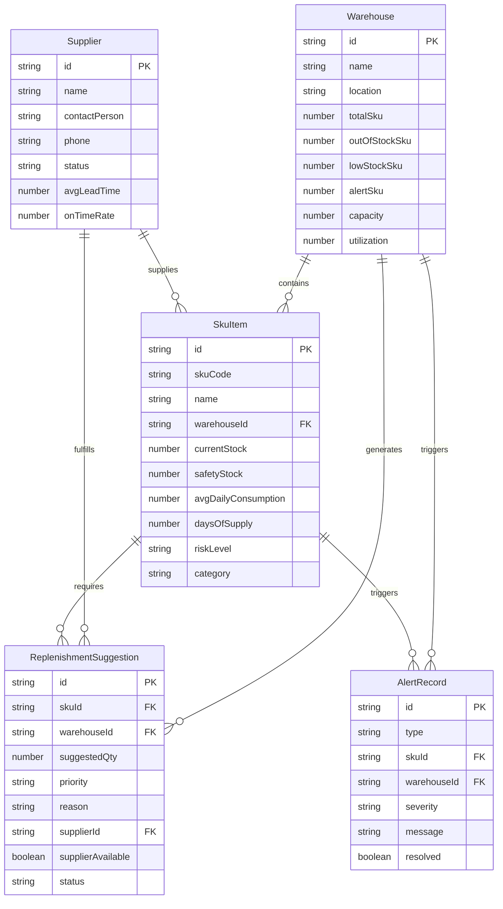

## 1. 架构设计

```mermaid
graph TB
    subgraph "前端层"
        "React App" --> "页面组件"
        "页面组件" --> "业务组件"
        "业务组件" --> "UI基础组件"
        "页面组件" --> "Zustand Store"
        "Zustand Store" --> "Mock Data Engine"
    end
    subgraph "数据层"
        "Mock Data Engine" --> "仓库数据"
        "Mock Data Engine" --> "SKU数据"
        "Mock Data Engine" --> "供应商数据"
        "Mock Data Engine" --> "预警规则"
    end
    subgraph "计算层"
        "Mock Data Engine" --> "风险计算引擎"
        "风险计算引擎" --> "补货建议生成"
        "补货建议生成" --> "供应商匹配"
        "预警规则" --> "模拟预警引擎"
    end
```

## 2. 技术说明

- 前端：React@18 + TypeScript + Tailwind CSS@3 + Vite
- 初始化工具：vite-init（react-ts 模板）
- 后端：无（纯前端项目，本地模拟数据）
- 数据库：无（使用 Zustand Store + 本地 JSON 模拟数据）
- 状态管理：Zustand
- 图表库：Recharts（轻量级 React 图表库）
- 图标：lucide-react

## 3. 路由定义

| 路由 | 用途 |
|------|------|
| / | 看板主页，展示仓库概览、SKU风险摘要、预警通知、趋势迷你图 |
| /sku-risk | SKU风险详情页，风险分级列表与异常处理逻辑 |
| /replenishment | 补货建议面板，建议列表与采购单生成 |
| /supplier | 供应商协同视图，供应商状态矩阵与缺失标记 |
| /trends | 趋势概览页，库存趋势图与KPI指标 |
| /simulation | 模拟预警中心，参数调节与模拟运行 |

## 4. API定义

本项目为纯前端应用，不涉及后端API。所有数据通过本地 Mock 数据引擎生成，核心数据接口定义为 TypeScript 类型：

```typescript
interface Warehouse {
  id: string;
  name: string;
  location: string;
  totalSku: number;
  outOfStockSku: number;
  lowStockSku: number;
  alertSku: number;
  capacity: number;
  utilization: number;
}

interface SkuItem {
  id: string;
  skuCode: string;
  name: string;
  warehouseId: string;
  currentStock: number;
  safetyStock: number;
  avgDailyConsumption: number;
  daysOfSupply: number;
  riskLevel: 'out_of_stock' | 'low' | 'normal';
  supplierIds: string[];
  lastReplenished: string;
  category: string;
}

interface Supplier {
  id: string;
  name: string;
  contactPerson: string;
  phone: string;
  status: 'active' | 'inactive' | 'blacklisted';
  avgLeadTime: number;
  onTimeRate: number;
  coveredSkuIds: string[];
  lastOrderDate: string;
}

interface ReplenishmentSuggestion {
  id: string;
  skuId: string;
  warehouseId: string;
  suggestedQty: number;
  priority: 'urgent' | 'high' | 'medium' | 'low';
  reason: string;
  supplierId: string | null;
  supplierAvailable: boolean;
  estimatedArrival: string | null;
  status: 'pending' | 'approved' | 'ordered' | 'delivered';
}

interface AlertRecord {
  id: string;
  type: 'out_of_stock' | 'low_stock' | 'supplier_missing' | 'lead_time_overdue';
  skuId: string;
  warehouseId: string;
  severity: 'critical' | 'warning' | 'info';
  message: string;
  timestamp: string;
  resolved: boolean;
  actionSuggestion: string;
}

interface SimulationParams {
  safetyStockDays: number;
  consumptionMultiplier: number;
  alertThreshold: number;
  leadTimeBuffer: number;
}

interface TrendDataPoint {
  date: string;
  totalStock: number;
  alertCount: number;
  replenishmentCount: number;
  outOfStockCount: number;
}
```

## 5. 服务器架构图

不适用（纯前端项目）

## 6. 数据模型

### 6.1 数据模型定义



### 6.2 数据定义语言

不适用（使用 TypeScript 类型定义 + 本地 JSON 模拟数据）
